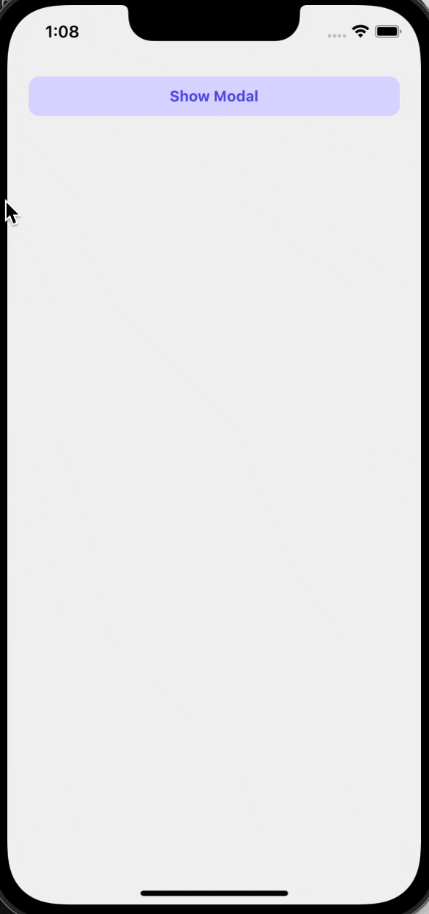

# rn-multi-selected-modal

[](https://www.npmjs.com/package/rn-multi-selected-modal)
[](https://www.npmjs.com/package/rn-multi-selected-modal)

A modal to select multi items from a list of data for React native. Platform Android/ios.





# Getting started

## Installation

Install the package in your React Native project:

```sh
yarn add rn-multi-selected-modal
```
### OR

```sh
npm install rn-multi-selected-modal
```

## Installing dependencies

Install the package we need as a dependency

```sh
yarn add react-native-svg
```
### OR
```sh
npm install react-native-svg
```
## Link native code

If yoy want yo use it for ios platform

```sh
cd ios && pod install
```

# Usage 

```js
import React, { useState } from 'react'
import {  Text, SafeAreaView, Pressable, StyleSheet } from 'react-native'
import {MultiSelected} from 'rn-multi-selected-modal';

const App = () => {

    interface List {
        id: string,
        title: string,
    }

    const [modalVisible, setModalVisible] = useState(false)

    const data = [
        { id: 1, title: "John Smith" },
        { id: 2, title: "Jane Doe" },
        { id: 3, title: "Adam Johnson" },
        { id: 4, title: "Emily Davis" },
        { id: 5, title: "Michael Wilson" }
    ]

    const [selectedItems, setSelectedItems] = useState<List[]>([])

    const onSelectHandler = (item: any) => {

        if (selectedItems.some((i) => i.id === item.id)) {
            let newSelectedItems = [...selectedItems]
            const index = selectedItems.findIndex((i) => i.id === item.id)
            if (index > -1) {
                newSelectedItems.splice(index, 1)
                setSelectedItems(newSelectedItems)
            }

        } else {
            setSelectedItems([...selectedItems, item])
        }
    }

    return (
        <SafeAreaView>
            <Pressable
                onPress={() => setModalVisible(true)}>
                <Text style={styles.textStyle}>Show Modal</Text>
            </Pressable>
            <MultiSelected
                data={data}
                modalVisible={modalVisible}
                selectedItems={selectedItems}
                onChangeSelect={onSelectHandler}
                onClose={() => setModalVisible(false)}
            />
        </SafeAreaView>
    )
}
```

# Properties

We have the props as following for customizing and pass data:

## Required

| Prop                 | Description                                                                                              | Default     |
| -------------------- | -------------------------------------------------------------------------------------------------------- | ----------- |
| **`data`**           | List of data with an id:string or number &  title:string.                                                | Empty Array |
| **`onClose`**        | A function that make the modal visible false                                                             | _None_      |
| **`modalVisible`**   | Value that shows the visibility of modal.                                                                | false       |
| **`selectedItems`**  | List of items that are selected.                                                                         | Empty Array |
| **`onChangeSelect`** | A function that describe what you want to do on selecting an item (we retuen the selected item for you). | _None_      |

## Optional

| Prop                         | Description                                                                  | Default                                               |
| ---------------------------- | ---------------------------------------------------------------------------- | ----------------------------------------------------- |
| **`checkBoxColor`**          | The color of checkbox when the item is selected. It should be a string value | "#5850EC"                                             |
| **`itemTitleStyle`**         | Style of the item's title.                                                   | [Text style](https://reactnative.dev/docs/style.html) |
| **`confirmBtnTitle`**        | The title of button that close the modal. It should be a string value        | Confirm                                               |
| **`confirmBtnStyle`**        | Style of the confirm button                                                  | [View style](https://reactnative.dev/docs/style.html) |
| **`confirmTxtStyle`**        | Style of the confirm button title.                                           | [Text style](https://reactnative.dev/docs/style.html) |
| **`searchPlaceHolder`**      | The text as a placeholder in search input. It should be a string value       | Search by name                                        |
| **`checkBoxContainerStyle`** | Style of the check boxes                                                     | [View style](https://reactnative.dev/docs/style.html) |
